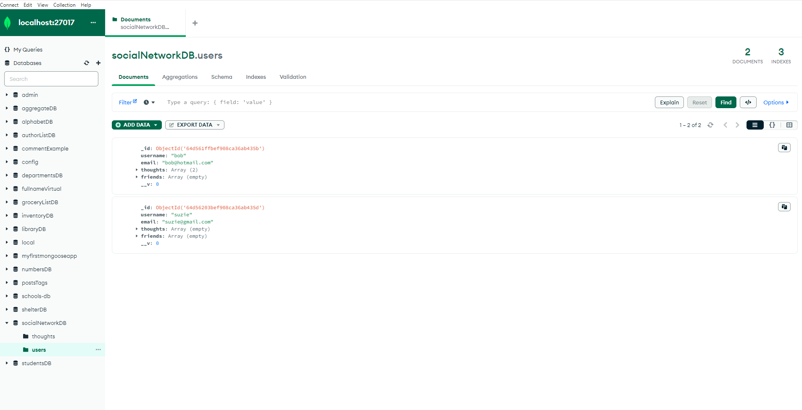
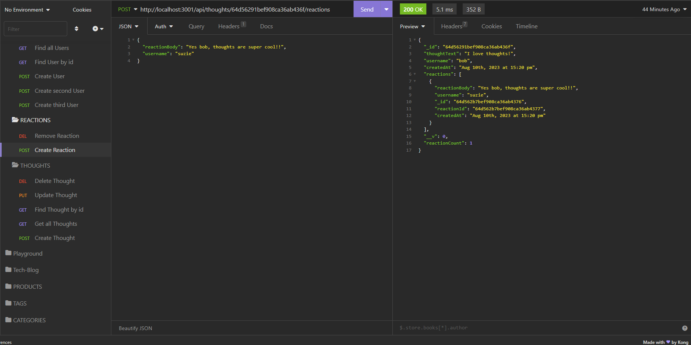
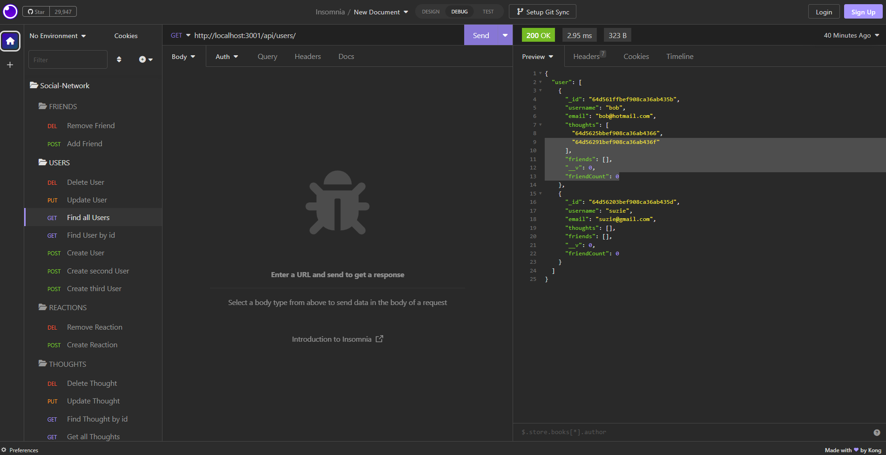

# social-network-api
    
  ## License
   
 
  (https://www.gnu.org/licenses/gpl-3.0)

  ## Description
  - GIVEN a social network API
  - WHEN I enter the command to invoke the application
  - THEN my server is started and the Mongoose models are synced to the MongoDB database
  - WHEN I open API GET routes in Insomnia for users and thoughts
  - THEN the data for each of these routes is displayed in a formatted JSON
  - WHEN I test API POST, PUT, and DELETE routes in Insomnia
  - THEN I am able to successfully create, update, and delete users and thoughts in my database
  - WHEN I test API POST and DELETE routes in Insomnia
  - THEN I am able to successfully create and delete reactions to thoughts and add and remove friends to a user’s friend list

  ## Table of Contents
  - [License](#license)
  - [Installation](#installation)
  - [Usage](#usage)
  - [Contribution](#contribution)
  - [Test](#test)
  - [Badges](#badges)
  - [Features](#features)

  ## Installation
  Clone: https://github.com/jeremiahmiranda79/social-network-api

  Install packages: npm i Start server: npm start 

  ## Usage
  Watch demo video here: https://drive.google.com/file/d/1qDRT0axKWJJtCxA0RYMgpezm6VKZzL-G/view

  ## Contribution
  I used my README.md file generator to create this README.md 😉

  GitHub: https://github.com/jeremiahmiranda79/Pro-README-FILE-Generator

  Email: jeremiahmiranda79@gmail.com

  ## Test
  N/A

  ## Badges
         

  ## Features
  TODO: Manually add you features here(for now 😉)!
  
   - Mongodb
  

   - Insomnia tests
  

  - Insomnia tests
  

  - Thank you for checking out my app!